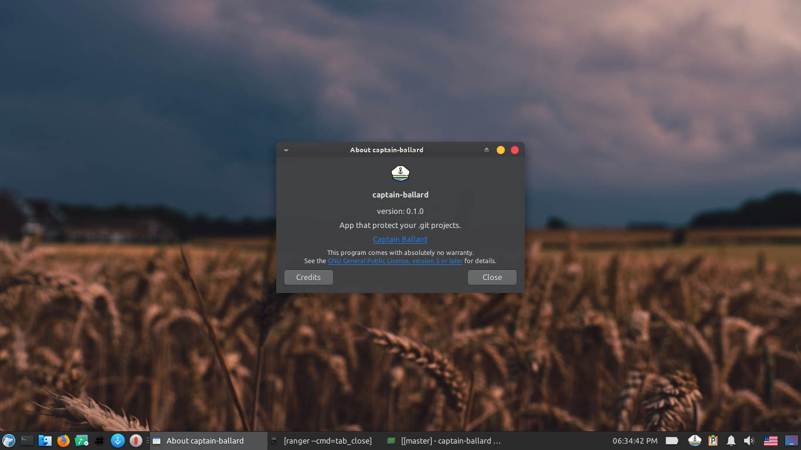

# captain-ballard   
Git-aware app that protect your projects before too late:)

## Preview

## A long time ago..
I had lots of projects in my computer and some of them managed by git. after a couple of months, by accident i lost my whole data and projects.
And that accident was a good motivation for me to keep my projects safe.

## Features
Watch __.git__ directories on your hard-drive and show a window that contain changes in your projects periodically(You can adjust the period time).

### Arch
[WIP]

### Void
[WIP]

### Build From Source
2. Install these dependencies first:

|Dependencies||
|-----|:-----:|
|[cmake](https://www.archlinux.org/packages/extra/x86_64/git/)|
|[gtk+-3.0](https://www.archlinux.org/packages/extra/x86_64/qt5-base/)|
|[sqlite3](https://www.archlinux.org/packages/extra/x86_64/qt5-quickcontrols/)|
|[libgit2](https://www.archlinux.org/packages/extra/x86_64/qt5-quickcontrols2/)|
|[appindicator](https://www.archlinux.org/packages/extra/x86_64/qt5-quickcontrols2/)|

3. clone the repo:

    `git clone https://github.com/LinArcX/captain-ballard/`

4. go to cloned directory and make the project with qmake build tools:

    `cd captain-ballard`

    `mkdir build; cd build/`

    `cmake -DCMAKE_BUILD_TYPE=Release ../`

    `make`

5. run the application:

    `../release/captain-ballard`

## Contributing
 
1. Fork it!
2. Create your feature branch: `git checkout -b my-new-feature`
3. Commit your changes: `git commit -am 'Add some feature'`
4. Push to the branch: `git push origin my-new-feature`
5. Submit a pull request :D

## Bugs
 

Bugs should be reported [here](https://github.com/LinArcX/captain-ballard/issues) on the Github issues page.

## Credits
E-Mail:linarcx@gmail.com

## What is Captain Ballard?
> Captain Ballard (played by Roy Jones Jr.), was the captain of the Zion hovercraft Caduceus in the film The Matrix Reloaded.

<h1 align="center">
	
	 
	 
    <p2>captain-ballard</p2>
</h1>

## License

